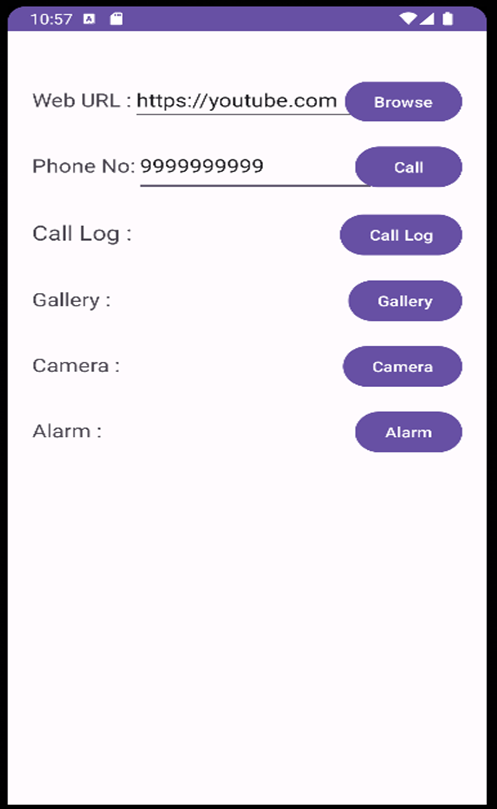

# P5_21012011046

# Implicit Intent Demo

This is a simple Android application that demonstrates the use of implicit intents for various features. It allows you to perform the following actions:

1. Make a call to a specific phone number.
2. Open a specific URL in a web browser.
3. Open the call log.
4. Open the gallery to view images.
5. Open the device's camera.
6. Set an alarm.

## Submitted By

- **Name:** MAKWANA SWASTIK PRAVIN
- **Enrollment Number:** 21012011046

## Code Overview

### Activity_main.xml

The XML layout file (`activity_main.xml`) defines the user interface elements, including text views, edit text fields, and buttons for each feature.

```xml
<?xml version="1.0" encoding="utf-8"?>
<androidx.constraintlayout.widget.ConstraintLayout xmlns:android="http://schemas.android.com/apk/res/android"
    xmlns:app="http://schemas.android.com/apk/res-auto"
    xmlns:tools="http://schemas.android.com/tools"
    android:layout_width="match_parent"
    android:layout_height="match_parent"
    tools:context=".MainActivity"
    android:padding="20dp"
    android:layout_marginTop="30dp">
    <TextView
        android:id="@+id/textView"
        android:layout_width="wrap_content"
        android:layout_height="wrap_content"
        android:layout_marginTop="5dp"
        android:text="Web URL : "
        android:textSize="18sp"
        app:layout_constraintStart_toStartOf="parent"
        app:layout_constraintTop_toTopOf="parent" />

    <EditText
        android:id="@+id/url"
        android:layout_width="wrap_content"
        android:layout_height="wrap_content"
        android:ems="9"
        android:inputType="text"
        app:layout_constraintBaseline_toBaselineOf="@+id/textView"
        app:layout_constraintEnd_toEndOf="@id/browse"
        app:layout_constraintStart_toStartOf="@id/textView" />

    <Button
        android:id="@+id/browse"
        android:layout_width="wrap_content"
        android:layout_height="wrap_content"
        android:text="Browse"
        app:layout_constraintBaseline_toBaselineOf="@+id/url"
        app:layout_constraintEnd_toEndOf="parent"
        app:layout_constraintTop_toTopOf="parent" />

    <TextView
        android:id="@+id/textView2"
        android:layout_width="wrap_content"
        android:layout_height="wrap_content"
        android:layout_marginTop="40dp"
        android:text="Phone No:"
        android:textSize="18sp"
        app:layout_constraintStart_toStartOf="parent"
        app:layout_constraintTop_toBottomOf="@+id/textView" />

    <EditText
        android:id="@+id/phone"
        android:layout_width="197dp"
        android:layout_height="54dp"
        android:ems="9"
        android:inputType="phone"
        app:layout_constraintBaseline_toBaselineOf="@+id/textView2"
        app:layout_constraintEnd_toEndOf="@id/call"
        app:layout_constraintHorizontal_bias="0.543"
        app:layout_constraintStart_toStartOf="@id/textView2" />

    <Button
        android:id="@+id/call"
        android:layout_width="wrap_content"
        android:layout_height="wrap_content"
        android:text="Call"
        app:layout_constraintBaseline_toBaselineOf="@+id/phone"
        app:layout_constraintEnd_toEndOf="parent" />

    <TextView
        android:id="@+id/textView3"
        android:layout_width="wrap_content"
        android:layout_height="wrap_content"
        android:layout_marginTop="40dp"
        android:text="Call Log :"
        android:textSize="20sp"
        app:layout_constraintStart_toStartOf="parent"
        app:layout_constraintTop_toBottomOf="@+id/textView2" />

    <Button
        android:id="@+id/callLog"
        android:layout_width="wrap_content"
        android:layout_height="wrap_content"
        android:text="Call Log"
        app:layout_constraintBaseline_toBaselineOf="@+id/textView3"
        app:layout_constraintEnd_toEndOf="parent" />

    <TextView
        android:id="@+id/textView4"
        android:layout_width="wrap_content"
        android:layout_height="wrap_content"
        android:layout_marginTop="40dp"
        android:text="Gallery :"
        android:textSize="18sp"
        app:layout_constraintStart_toStartOf="parent"
        app:layout_constraintTop_toBottomOf="@+id/textView3" />

    <Button
        android:id="@+id/gallery"
        android:layout_width="wrap_content"
        android:layout_height="wrap_content"
        android:text="Gallery"
        app:layout_constraintBaseline_toBaselineOf="@+id/textView4"
        app:layout_constraintEnd_toEndOf="parent" />

    <TextView
        android:id="@+id/textView5"
        android:layout_width="wrap_content"
        android:layout_height="wrap_content"
        android:layout_marginTop="40dp"
        android:text="Camera :"
        android:textSize="18sp"
        app:layout_constraintStart_toStartOf="parent"
        app:layout_constraintTop_toBottomOf="@+id/textView4" />

    <Button
        android:id="@+id/camera"
        android:layout_width="wrap_content"
        android:layout_height="wrap_content"
        android:text="Camera"
        app:layout_constraintBaseline_toBaselineOf="@+id/textView5"
        app:layout_constraintEnd_toEndOf="parent" />

    <TextView
        android:id="@+id/textView6"
        android:layout_width="wrap_content"
        android:layout_height="wrap_content"
        android:layout_marginTop="40dp"
        android:text="Alarm :"
        android:textSize="18sp"
        app:layout_constraintStart_toStartOf="parent"
        app:layout_constraintTop_toBottomOf="@+id/textView5" />

    <Button
        android:id="@+id/alarm"
        android:layout_width="wrap_content"
        android:layout_height="wrap_content"
        android:text="Alarm"
        app:layout_constraintBaseline_toBaselineOf="@+id/textView6"
        app:layout_constraintEnd_toEndOf="parent" />

</androidx.constraintlayout.widget.ConstraintLayout>

```

### MainActivity.kt

The Kotlin code in `MainActivity.kt` handles the functionality of the app. It uses implicit intents to launch different actions based on user interactions with the buttons.

```kotlin
package com.example.pratical_5_046

import android.content.Intent
import android.net.Uri
import androidx.appcompat.app.AppCompatActivity
import android.os.Bundle
import android.provider.AlarmClock
import android.provider.CallLog
import android.provider.MediaStore
import android.widget.Button
import android.widget.EditText

class MainActivity : AppCompatActivity() {
    override fun onCreate(savedInstanceState: Bundle?) {
        super.onCreate(savedInstanceState)
        setContentView(R.layout.activity_main)
    implicit_Intent()
    }
    private fun implicit_Intent(){
        findViewById<Button>(R.id.browse).setOnClickListener{
            Intent(
                Intent.ACTION_VIEW,
                Uri.parse(findViewById<EditText>(R.id.url).text.toString())).also { startActivity(it) }
        }
        findViewById<Button>(R.id.call).setOnClickListener {
            val number = findViewById<EditText>(R.id.phone).text.toString().trim()
            Intent(Intent.ACTION_DIAL).setData(Uri.parse("tel:$number")).apply { startActivity(this) }
        }
        findViewById<Button>(R.id.callLog).setOnClickListener {
            Intent(Intent.ACTION_VIEW).setType(CallLog.Calls.CONTENT_TYPE).also {
                startActivity(it)
            }
        }
        findViewById<Button>(R.id.gallery).setOnClickListener {
            Intent(Intent.ACTION_VIEW).setType("image/*").also{
                startActivity(it)
            }
        }
        findViewById<Button>(R.id.camera).setOnClickListener {
            Intent(MediaStore.ACTION_IMAGE_CAPTURE).also { startActivity(it) }
        }
        findViewById<Button>(R.id.alarm).setOnClickListener {
            Intent(AlarmClock.ACTION_SHOW_ALARMS).also { startActivity(it) }
        }
    }
}
```

## Usage of Implicit Intents

- For opening a URL, it uses an `ACTION_VIEW` intent with the provided URL.
- For making a call, it uses an `ACTION_DIAL` intent with the phone number.
- For opening the call log, it uses an `ACTION_VIEW` intent with the `CallLog.Calls.CONTENT_TYPE`.
- For opening the gallery, it uses an `ACTION_VIEW` intent with the "image/*" type.
- For opening the camera, it uses an `ACTION_IMAGE_CAPTURE` intent.
- For setting an alarm, it uses an `ACTION_SHOW_ALARMS` intent.

## Screenshots


